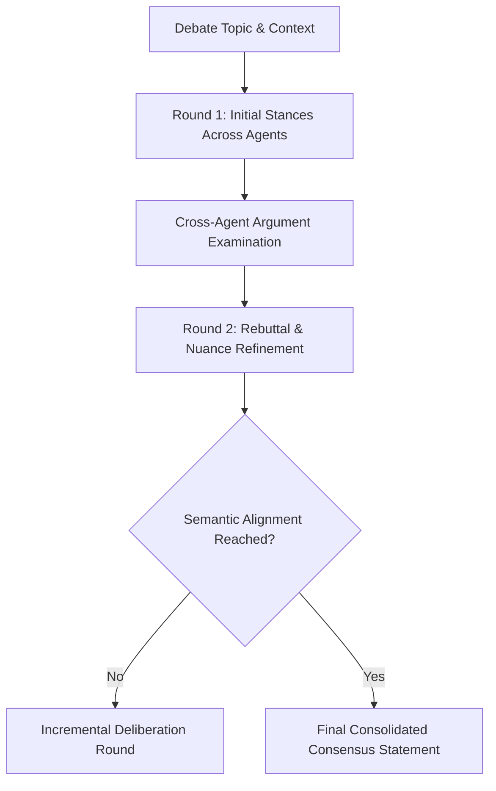

# genpark-multi-agent-debate-consensus-engine-skill

Agent Skill implementing **Multi-Agent Adversarial Debate & Consensus Synthesis** in 100% Python standard library.

## Architectural Flow

```mermaid
flowchart TD
    Topic["Debate Topic & Context"] --> Round1["Round 1: Initial Stances Across Agents"]
    Round1 --> Cross["Cross-Agent Argument Examination"]
    Cross --> Round2["Round 2: Rebuttal & Nuance Refinement"]
    Round2 --> Convergence{"Semantic Alignment Reached?"}
    Convergence -->|No| NextRound["Incremental Deliberation Round"]
    Convergence -->|Yes| Synthesis["Final Consolidated Consensus Statement"]
```
